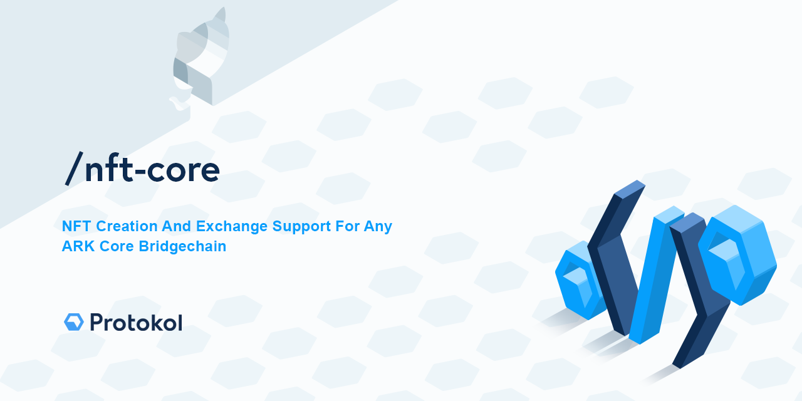

[](https://creativecommons.org/licenses/by-nc-sa/4.0/)

# NFT Functionality Built On Top of ARK Core

A monorepository containing a set of `@protokol` packages providing Digital Asset (NFT) Support for any ARK Core v3 based bridgechains. Plugins support the following main features:

-   digital asset creation (JSON Schema based asset structure)
-   digital asset trading (auction, bid, trade, transfer)
-   digital asset burning
-   supply management
-   full REST API Support for exchange and asset creation.

This work is licensed under [Creative Commons Attribution-NonCommercial-ShareAlike 4.0 International License](https://creativecommons.org/licenses/by-nc-sa/4.0/).

### Documentation

For more information and detailed documentation follow this link: https://docs.protokol.com/nft/.

### Examples

For examples head over to [examples](https://github.com/protokol/nft-plugins/tree/develop/packages/examples) package.

## List of packages:

This is a monorepo which contains many tools and packages:

| Plugin                                                                                                               | Description                                     | Version                                                                    |
| -------------------------------------------------------------------------------------------------------------------- | ----------------------------------------------- | -------------------------------------------------------------------------- |
| [nft-base-api](https://github.com/protokol/nft-plugins/tree/develop/packages/nft-base-api)                           | Base API Functionality                          |               |
| [nft-base-crypto](https://github.com/protokol/nft-plugins/tree/develop/packages/nft-base-crypto)                     | Asset creation and crypto transaction support   |            |
| [nft-base-transactions](https://github.com/protokol/nft-plugins/tree/develop/packages/nft-base-transactions)         | NFT Core v3 transactions engine (base)          |      |
| [nft-exchange-api](https://github.com/protokol/nft-plugins/tree/develop/packages/nft-exchange-api)                   | Exchange API Functionality                      |           |
| [nft-exchange-crypto](https://github.com/protokol/nft-plugins/tree/develop/packages/nft-exchange-crypto)             | Exchange crypto transaction support             |        |
| [nft-exchange-transactions](https://github.com/protokol/nft-plugins/tree/develop/packages/nft-exchange-transactions) | Exchange NFT Core v3 transactions engine        |  |
| [client](https://github.com/protokol/nft-plugins/tree/develop/packages/client)                                       | Protokol and ARK API REST Client Implementation |                     |

## Production install

Prepare and configure your bridgechain network configuration to install and load published packages from npm repository. A testnet configuration example can be found here: https://github.com/protokol/nft-plugins/blob/develop/config/networks/testnet/app.json.

## Development environment setup

### Source Code Setup

```bash
git clone https://github.com/protokol/nft-plugins
yarn && yarn build
```

### Run Local Testnet

Make sure your database is up and running (our use our `config/networks/` docker files).

```bash
# run PG docker
cd config/networks/testnet
docker-compose up postgres

#run full testnet
yarn full:testnet
```

# Contact Us For Support And Custom Development

info@protokol.com

# License

[](https://creativecommons.org/licenses/by-nc-sa/4.0/)

This work is licensed under [Creative Commons Attribution-NonCommercial-ShareAlike 4.0 International License](https://creativecommons.org/licenses/by-nc-sa/4.0/), under the following terms:

#### Attribution

You must give appropriate credit, provide a link to the license, and indicate if changes were made. You may do so in any reasonable manner, but not in any way that suggests the licensor endorses you or your use.

#### NonCommercial

You may not use the material for commercial purposes. For commercial purposes please reach out to info@protokol.com.

#### ShareAlike

If you remix, transform, or build upon the material, you must distribute your contributions under the same license as the original.

#### Legal code

Read the rest of the obligatory [license legal code](https://creativecommons.org/licenses/by-nc-sa/4.0/legalcode).

Copyright (c) Protokol.com 2020
