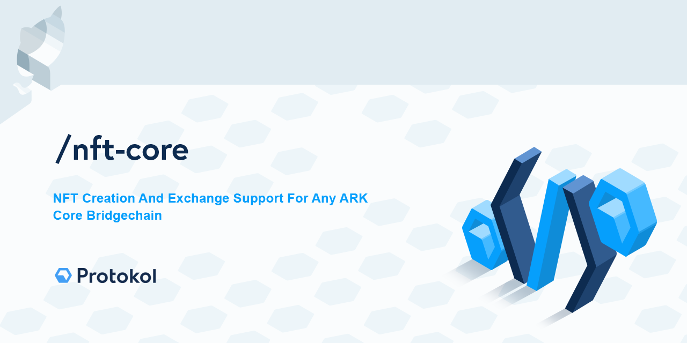

[](https://creativecommons.org/licenses/by-nc-sa/4.0/)

# NFT Functionality For ARK Core-v3 Bridgechains

A monorepository containing a set of ARK Core v3 plugins, providing base and exchange NFT Token Support for ARK Core v3 based bridgechains. Plugins support following main features - powered by Protokol NFT:

- asset creation (JSON Schema based asset structure)
- token trading (auction, bid, trade)
- token burning
- full REST API Support (htts://docs.protokol.com) for exchange and crypto.

This work is licensed under [Creative Commons Attribution-NonCommercial-ShareAlike 4.0 International License](https://creativecommons.org/licenses/by-nc-sa/4.0/).

## List of plugins:

| Plugin        | Description      | Version
| ------------- |--------------|---|
| [nft-base-api](https://github.com/protokol/nft-plugins/tree/develop/packages/nft-base-api)   | Base API Functionality | 
| [nft-base-crypto](https://github.com/protokol/nft-plugins/tree/develop/packages/nft-base-crypto) | Asset creation and crypto transaction support | 
| [nft-base-transactions](https://github.com/protokol/nft-plugins/tree/develop/packages/nft-base-transactions) | NFT Core v3 transactions engine (base) | 
| [nft-exchange-api](https://github.com/protokol/nft-plugins/tree/develop/packages/nft-exchange-api)   | Exchange API Functionality | 
| [nft-exchange-crypto](https://github.com/protokol/nft-plugins/tree/develop/packages/nft-exchange-crypto) | Exchange crypto transaction support  | 
| [nft-exchange-transactions](https://github.com/protokol/nft-plugins/tree/develop/packages/nft-exchange-transactions) | Exchange NFT Core v3 transactions engine | 
| [nft-generator-api](https://github.com/protokol/nft-plugins/tree/develop/packages/nft-generator-api) | Helper plugin for quick asset generation | 
| [nft-client](https://github.com/protokol/nft-plugins/tree/develop/packages/nft-client) | NFT and ARK API REST Client Implementation | 

## Production install
Prepare and configure your bridgechain network configuration to install and load published packages from npm repository. A testnet configuration example can be found here: https://github.com/protokol/core-nft/blob/conf/nft-token-develop/packages/core/bin/config/testnet/app.json#L20-L44. We need to add the following entries to packages:

```json
  {
      "package": "@protokol/nft-base-transactions"
  },
  {
      "package": "@protokol/nft-exchange-transactions"
  },
  {
      "package": "@protokol/nft-base-api"
  },
  {
      "package": "@protokol/nft-exchange-api"
  },
  {
      "package": "@protokol/nft-generator-api"
  }
```

You could also use our [core-nft](https://github.com/protokol/core-nft) branch of ARK Core-v3, where this is already setup for testnet environment (don't forget to update package.json in your core bridgechain branch).

## Source Install
### Development environment setup

Development environment is setup in the same way as we setup ARK Core v3 development environment. To Learn more about how to achieve this check this link:
https://learn.ark.dev/core-getting-started/setting-up-your-development-environment

### Source Code Setup

```bash
git clone https://github.com/protokol/core-nft
cd core-nft
git clone https://github.com/protokol/nft-plugins protokol/

# run yarn setup from root folder
yarn setup:clean
```

### Run Local Testnet

Check here how to run your local Testnet:
https://learn.ark.dev/core-getting-started/spinning-up-your-first-testnet

# Contact Us For Support And Custom Development
info@protokol.com

# License
[](https://creativecommons.org/licenses/by-nc-sa/4.0/)

This work is licensed under [Creative Commons Attribution-NonCommercial-ShareAlike 4.0 International License](https://creativecommons.org/licenses/by-nc-sa/4.0/), under the following terms:

#### Attribution

You must give appropriate credit, provide a link to the license, and indicate if changes were made. You may do so in any reasonable manner, but not in any way that suggests the licensor endorses you or your use.

#### NonCommercial

You may not use the material for commercial purposes. For commercial purposes please reach out to info@protokol.com.

#### ShareAlike

If you remix, transform, or build upon the material, you must distribute your contributions under the same license as the original.

#### Legal code

Read the rest of the obligatory [license legal code](https://creativecommons.org/licenses/by-nc-sa/4.0/legalcode).

Copyright (c) Protokol.com 2020
