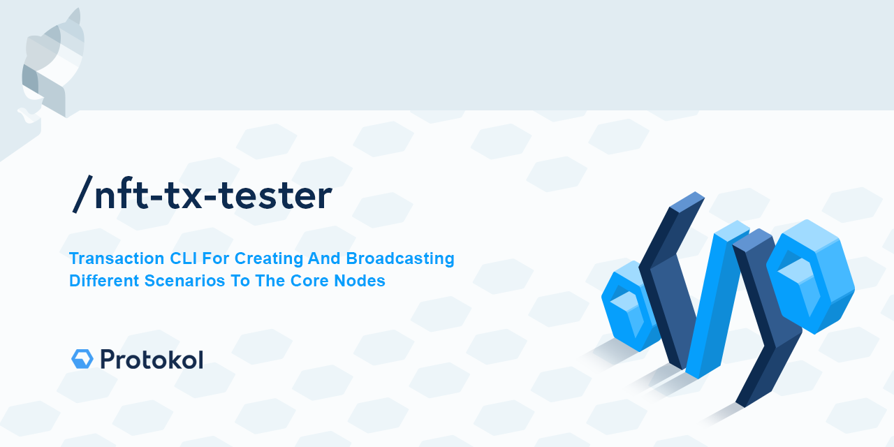

[](https://creativecommons.org/licenses/by-nc-sa/4.0/)

# NFT Tx Tester

A Protokol module providing command line utility for creating and broadcasting NFT transactions.

## Source Install

### Source Code Setup

#### Install the dependencies
```bash
yarn
```
#### Run NFT Tx Tester
you can run the project with custom config
```bash
yarn start "pathToConfigFile"
```

or use a default one from `nft-tx-tester/src/config/config.ts`
```bash
yarn start
```

# Contact Us For Support And Custom Development
info@protokol.com
